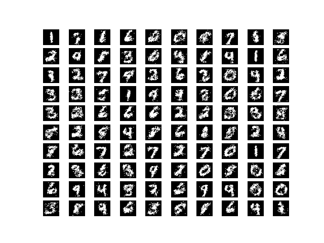

# Restricted Boltzmann Machine Example

This DBM implementation is based on algorithm 20.1 of [deep learning book](https://www.deeplearningbook.org/) (page 670). It maximizes the evidence lower bound to approximate the intractable log-likelihood `p(v)` and uses the mean-field approach to approximate the posterior `p(h|v)`. Additionally, it incorporates the PCD-k algorithm and Markov Chain Monte Carlo (MCMC) to approximate model samples in the negative phase.


## Getting Started

```bash
pip install -r requirements.txt
python main.py
```
## usage:
```
 main.py [-h] [--batch BATCH] [--epochs EPOCHS] [--lr LR] [--arc ARC] [--n N] [--k K] [--save]
```

## options:
```
  -h, --help       show this help message and exit
  --batch BATCH    Batch size for training.
  --epochs EPOCHS  Number of epochs for training.
  --lr LR          Learning rate for training.
  --arc ARC        Model architucture ex: '784, 200, 100'
  --n N            Number of Mean field update steps during training
  --k K            Number of Gibbs steps during training
  --save           Save the model after training
```

## Results:
Models samples at epoch 10:

