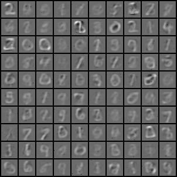

# Denoising Diffusion Probabilistic Models (DDPM) Example

This is a basic implementation of ddpm paper:  [Denoising Diffusion Probabilistic Models](https://arxiv.org/pdf/2006.11239.pdf)


## Getting Started

```bash
pip install -r requirements.txt
python main.py
```
## usage:
``` 
main.py [-h] [--batch BATCH] [--epochs EPOCHS] [--lr LR] [--save] [--num_steps NUM_STEPS] [--beta_start BETA_START] [--beta_end BETA_END] [--sigma SIGMA]
```

## options:
```  
  -h, --help              show this help message and exit
  --batch BATCH           Batch size for training.
  --epochs EPOCHS         Number of epochs for training.
  --lr LR                 Learning rate for training.
  --save                  Save the model after training
  --num_steps NUM_STEPS
                          Number of diffusion steps
  --beta_start BETA_START
                          Variance schedule starting value
  --beta_end BETA_END     Variance schedule ending value
  --sigma SIGMA           Reverse process Variance
```

## Results:
Models results at epoch 10:





