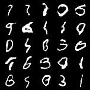

# Deep Convolutional Generative Adversarial (DCGAN) Example

a simple example of DCGAN on MNIST dataset based on the paper: [Unsupervised Representation Learning With Deep Convolutional Generative Adversarial](https://arxiv.org/pdf/1511.06434.pdf)


## Getting Started

```bash
pip install -r requirements.txt
python main.py
```
## usage:
``` 
usage: main.py [-h] [--batch BATCH] [--epochs EPOCHS] [--latent_dim LATENT_DIM] [--lr LR] [--save]
```
## options:
```  
  -h, --help              show this help message and exit
  --batch BATCH           Batch size for training.
  --epochs EPOCHS         Number of epochs for training.
  --latent_dim LATENT_DIM Latent dimension
  --lr LR                 Learning rate for training.
  --save                  Save the model after training
```

## Results:
Models results at epoch 5:




