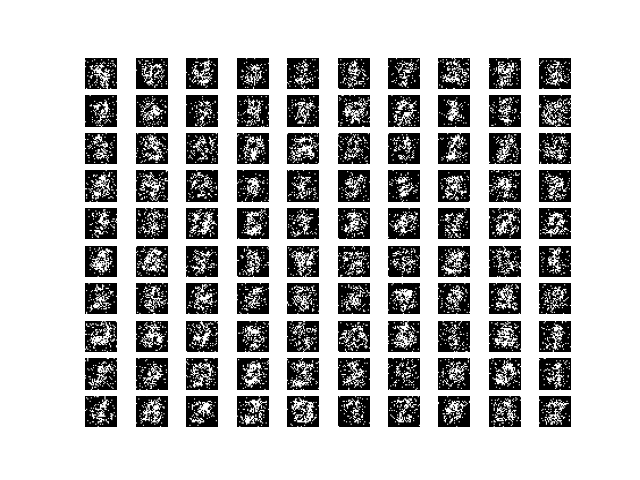

# Variational Autoencoder (VAE) Example

This VAE implementation is for the case when both the prior and the posterior approximation are Gaussian see appendix B of paper:  [Auto-Encoding Variational Bayes](https://arxiv.org/abs/1312.6114)


## Getting Started

```bash
pip install -r requirements.txt
python main.py
```
## usage:
``` 
main.py [-h] [--batch BATCH] [--epochs EPOCHS] [--lr LR] [--save]
```
## options:
```  
-h, --help       show this help message and exit
  --batch BATCH    Batch size for training.
  --epochs EPOCHS  Number of epochs for training.
  --lr LR          Learning rate for training.
  --save           Save the model after training
```

## Results:
Models results at epoch 10:


`Reconstruction results`




`Model samples`


